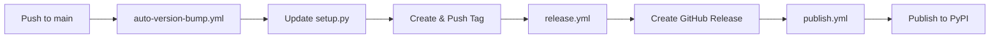

# GitHub Actions Workflow Setup Guide

This guide explains the automated workflows for version bumping, release creation, and publishing.

## Current Workflows

### 1. Auto Version Bump (`auto-version-bump.yml`)

The workflow is configured to use the **AutoBot-Callidio** GitHub App for authentication, which provides secure, automated version bumping with direct commits to the main branch.

#### How It Works

1. **Automatic Versioning**: The workflow runs on every push to main
2. **Version Calculation**: Uses semantic versioning based on commit history
3. **Direct Commit**: Updates `setup.py` and commits directly to main (no PR)
4. **Git Tagging**: Creates and pushes annotated git tags (e.g., `1.1.2`)
5. **GitHub App Auth**: Uses AutoBot-Callidio app credentials for authentication

### 2. Auto Release (`release.yml`)

When a tag is pushed (automatically by the version bump workflow or manually), this workflow creates a GitHub release.

#### How It Works

1. **Trigger**: Runs automatically when any tag is pushed to the repository
2. **Release Notes**: Uses GitHub's automatic release notes generation
3. **Changelog**: Automatically generates changelog from commits since last release
4. **GitHub Release**: Creates a release with the tag name and generated notes

#### Features

- ✅ **Fully Automated**: No manual intervention required
- ✅ **Automatic Notes**: GitHub automatically generates meaningful release notes
- ✅ **Changelog Generation**: Automatically includes all changes since previous tag
- ✅ **GitHub App Auth**: Uses AutoBot-Callidio app for consistent authentication

### 3. Publishing (`publish.yml`)

Triggered by release creation, this workflow publishes the package to PyPI.

### GitHub App Configuration

Both the auto-version-bump and auto-release workflows use these repository secrets:
- `AUTOBOT_CALLIDIO_APP_ID`: The GitHub App ID
- `AUTOBOT_CALLIDIO_PRIVATE_KEY`: The GitHub App private key

The AutoBot-Callidio app has been added to branch protection rule exceptions, allowing it to push directly to the protected main branch and create releases.

## Complete Automation Flow



### Step-by-Step Process

1. **Developer pushes code** to `main` branch
2. **auto-version-bump.yml** calculates the next version and updates `setup.py`
3. **Tag is created** (e.g., `1.2.3`) and pushed to the repository
4. **release.yml** is triggered by the new tag
5. **GitHub Release is created** with AI-generated release notes
6. **publish.yml** is triggered by the release creation
7. **Package is published** to PyPI automatically

## Workflow Features

### Version Bumping
- Automatically calculates next semantic version
- Updates version in `setup.py`
- Commits changes with detailed changelog

### Git Tagging
- Creates annotated tags with version number (e.g., `1.2.3`)
- Includes changelog in tag message
- Pushes tags to remote repository

### Authentication
- Uses GitHub App token generation via `actions/create-github-app-token@v1`
- More secure than Personal Access Tokens
- Provides fine-grained permissions
- Works with branch protection rules

## Benefits of GitHub App Authentication

✅ **Enhanced Security**: App tokens are short-lived and scoped  
✅ **Branch Protection**: Can bypass protection rules when configured  
✅ **Audit Trail**: Actions attributed to the bot account  
✅ **No Token Expiration**: Unlike PATs, app credentials don't expire  
✅ **Fine-Grained Access**: Specific repository permissions  

## Workflow Behavior

### Triggered On
- Push to `main` branch
- Manual workflow dispatch

### Actions Performed
1. Generate temporary token from GitHub App credentials
2. Checkout repository with full history
3. Calculate next version using semver-action
4. Update version in `setup.py`
5. Commit changes to main branch
6. Create and push git tag with version

### Skip Conditions
- No version bump needed (determined by semver-action)
- No commits since last version

## Troubleshooting

### Auto Version Bump Issues

#### Workflow fails with "Permission denied"

Check that:
- `AUTOBOT_CALLIDIO_APP_ID` secret is set correctly
- `AUTOBOT_CALLIDIO_PRIVATE_KEY` secret contains the full private key
- The GitHub App is installed on the repository
- The app has `contents: write` permission

#### Workflow fails with "Branch protection"

Ensure:
- AutoBot-Callidio app is added to branch protection rule exceptions
- The app has permission to push to protected branches

#### Version not incrementing

This is normal if:
- No new commits since last version bump
- Commits don't trigger version changes per semver rules
- Tags already exist for the calculated version

#### Tag already exists

The workflow will fail if:
- A tag with the calculated version already exists
- Solution: Delete the tag or make additional commits to bump version

### Auto Release Issues

#### Release not created after tag push

Check that:
- The `release.yml` workflow file exists in `.github/workflows/`
- The workflow has `contents: write` permission
- The tag was successfully pushed to the remote repository
- Check the Actions tab for any workflow errors

#### Release notes are empty or incomplete

This can happen if:
- No commits exist between the current and previous tag
- Commit messages don't follow conventional commit format
- Solution: Ensure commits have clear, descriptive messages

#### Duplicate releases

If a release already exists for a tag:
- The workflow will fail with "already exists" error
- Delete the existing release and re-run the workflow
- Or create a new tag with a different version

## Modifying the Workflow

### Change Version Calculation
Edit the `semver-action` parameters:
```yaml
- name: Calculate next version
  id: semver
  uses: ietf-tools/semver-action@v1
  with:
    branch: main
    patchAll: true          # Bump patch for all commits
    skipInvalidTags: true   # Ignore malformed tags
```

### Change Commit Message Format
Edit the commit step:
```yaml
git commit -m "chore(release): bump version to ${NEXT_VERSION}"
```

### Add Additional Files to Commit
Modify the git add command:
```yaml
git add setup.py other-file.txt
```

## Security Best Practices

1. **Keep Private Key Secure**: Never expose `AUTOBOT_CALLIDIO_PRIVATE_KEY`
2. **Limit App Permissions**: Only grant necessary permissions to the app
3. **Regular Audits**: Review app activity in GitHub's audit log
4. **Rotate Keys**: Generate new private keys if compromised
5. **Use Environments**: Consider using GitHub Environments for additional protection

## GitHub App Permissions Required

The AutoBot-Callidio app needs:
- **Contents**: Read and write (for commits and tags)
- **Metadata**: Read (automatically granted)

## Alternative: Using PAT Instead

If you prefer using a Personal Access Token instead of a GitHub App, see the git history for the previous PAT-based configuration. However, GitHub Apps are recommended for better security and integration with branch protection rules.

## Additional Resources

- [GitHub Apps Documentation](https://docs.github.com/en/apps)
- [actions/create-github-app-token](https://github.com/actions/create-github-app-token)
- [Semantic Versioning](https://semver.org/)
- [Git Tagging](https://git-scm.com/book/en/v2/Git-Basics-Tagging)
